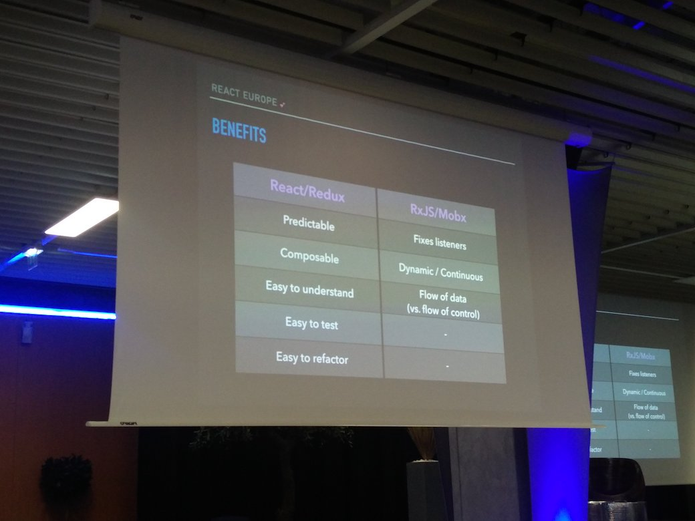
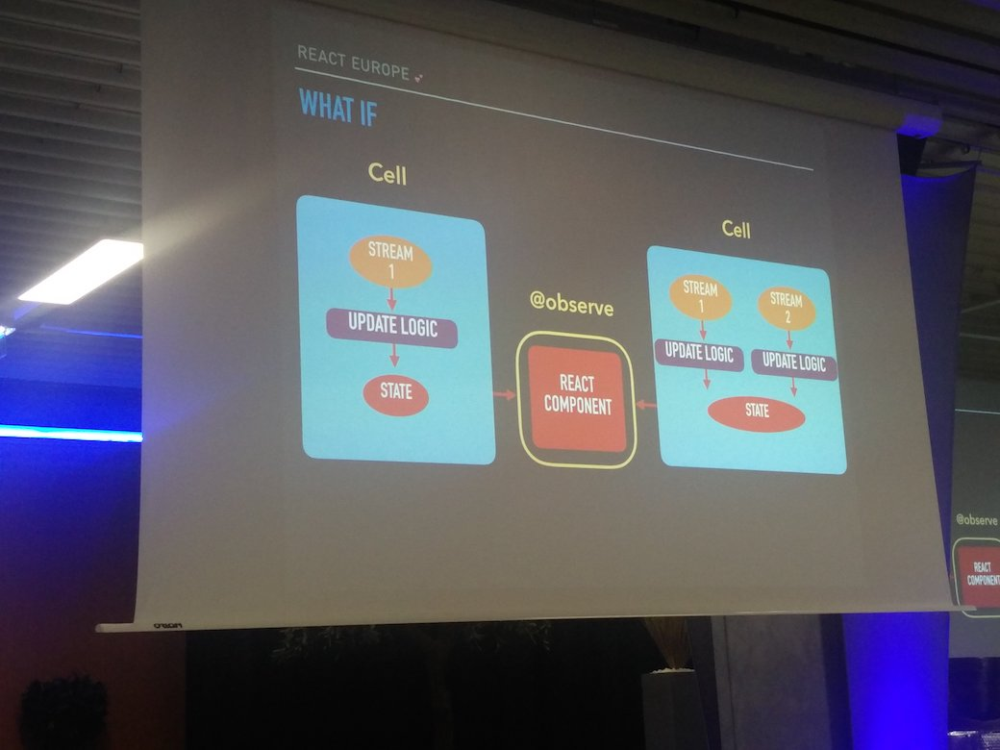
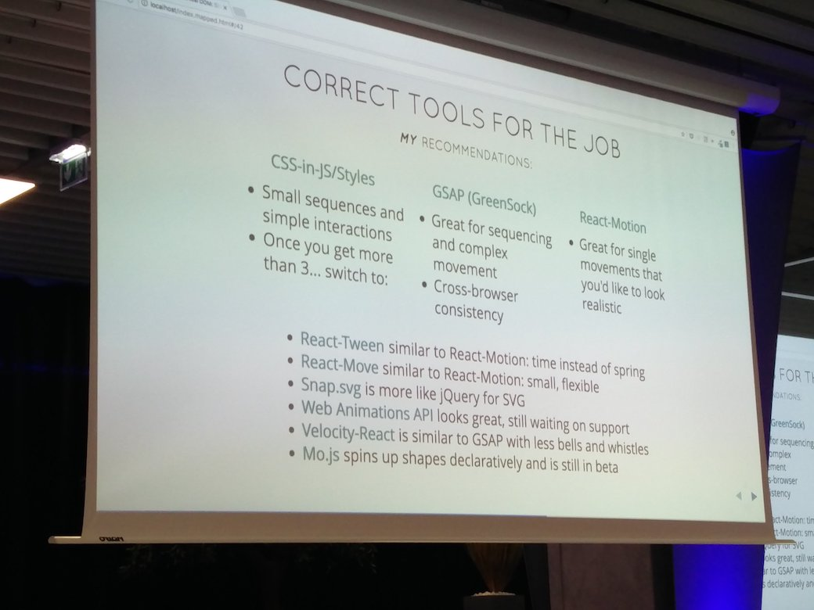

## Mobx 10:00 AM

store restore snapshots
- cache
- offline

+ runtime type checking
+ replayable actions

## Composition 10.30 AM

chain in lodash, limitation : not extendable

pipe versus chaining
- easier syntaxe

pipe
- function composition

```js
pipe(a, b, c, d)
```

order from d to a and share result between each function until final result

### In React ?

Enhance components with functions

```js
import { compose } from 'ramda';
```

declarative composition for preventing function nesting

>**Polished** : css in js tool with composition

Compose styles to components

**Example**
```js
const tmpColor = lighten(0.3, '#F50');
```

Lighten can be composed with any color modification function

Requirements:
- input/output css values in functions
- every function return a function with color as an argument

**currying** notion : transform each arguments to a function

Native support in some languages
- ReasonML
- ELM

>lodash map : Revert arguments for composition
```js
map((name => name), names)
```

**Loading indicator example**

### Automatically condition Component with a loading state from props

```js
const withLoading = Component => ({ loading }) => (
  loading ? <div>loading</div> : <Component />
);
```

### With text

```js
const withLoading = text => Component => ({ loading }) => (
  loading ? <div>{text}</div> : <Component />
);

withLoading('Loading')(<section />);
```

**Animation example**

In this example 3D rendering is used and the animation of the y axis is extracted in a HOC

Benefits :
- testability
- isolation
- reusability

## The making of Twitter Lite 11:00 AM

Issue : slow internet dominates
- 47% 2G connection
- 21% 4G
- other 3G

The need of a very performant PWA

**Performance optimization**

Painting cycle :
- Splashscreen
- Header
- Content (First meaningful Paint)
- Interactive

### Working ideas

- Involving designers with shared language for better interface communication
- Full flexbox layout

## Lightning talks 12:00 AM

### React key prop

- known performance issue
- Performance benchmark with 5k iterations list with component render of 10ms

Functional component
Key ~60.1ms
NoKey ~60.3ms

PureComponent
Key ~1.3ms
NoKey ~19.9ms

>Always set keys !!!

### Async Import chunks

- stage-3 spec

```js
const React = await import('react');
```

Can be used to async components

Suggested strategy :
- split app and vendor code
- split at route level (async)
- split at component level (async)

## Lunch 12:30 AM


## React VR 2:00 PM

>VR is hard

Features
- 2D basics
- 3D Concepts
- Multimedia

Goal : easy access to VR with React

Used on prod for Facebook VR videos / photospheres

### Dev tools

chrome dev tools...
CPU performance audit with timeline

### Techniqual stack

State :
- Redux

Testing :
- flow + jest

### Architecture

**React VR Core**
Core renderer using system APIS

**React VR JS Runtime**
HMI management with Three.js and browser apis

Layout with [facebook/yoga](https://facebook.github.io/yoga/)

### HMI management

Maximize usage of available device sensors (orientation)

### Models

using THREE basic mesh to create custom models for every component.
Basically React will wrap every THREE mesh and manage its rendering.

### Usage

```js
npm i -g react-vr-cli
```

## Functional && Reactive 2:30 PM




## Relay 3:00 PM

**Responsiveness** : UI won't wait for server response to update

GraphQL Fragments

Thousands of components for each platform (web, mobile)

Goal : Maximize client rendering, don't be network dependant

Optimization roadmap :
- defer working operation
- memoization

### Relay modern

Application with Facebook : Loads 900ms faster !

New relay compiler to optimize query and file splitting for result

Removing react dependency :

Giving the opportuiny to use every library to plug with Relay modern

New "react-relay" library for react needs

>Announcing Relay v1.0.0 !

**Deploying**


**Deployed**


## Animating Virtual DOM 4:00 PM

twitter@sarah_edo

The future : FIBER \o/ (React 16)

- Animation update preferred to data update
- Priority-based scheduling of updates

>"So what" factor : User attention span is short (2 seconds)

Without animation user is badly notified of any content updates

> Goran Rakic loaders collection

SVG offers very strong performance and tiny weight

### Pro tip !
Animation duration hierarchization inspired by HTML headline tags

For example :
- **T1** - 1s
- **T2** : .5s
etc.

**MO.js** : motion library

>js SVG getTotalLenght on shape to get dash (stroke) length

Motion animation comparison



GSAP rules them all


> react-transition-group / react-transition-group-plus

## React as a Platform 4:30 PM

twitter@intelligibabble

**Step 1** : 3 different platforms
- Swift
- Java
- React / JS

**Step 2** : react-native
- mutualization for Android and IOS

**Step 3**
- react native for the web

>Write once, run anywhere ?

React for :
- ubuntu
- windows
- osx
- ios
- android
- ...

>React as a cross-platform solution

Example with cnotainers :

HTML rendering
```js
import { Div } from 'react-dom';
```

VR rendering
```js
import { View } from 'react-vr';
```

### Introducing "react-prmitives"

Components isolation in a dedicated npm package for cross-platform needs

Primitive components !
- View
- Text
- Image
- Stylesheet
- Touchable
- Animated
- Platform

Each component is chosen to represent a specific category for basic interface uses

View, Text, Image : interface structure
Styleshet : visual representation
Touchable : HMI

Still possible to override react-primitives

```
import { inject } from 'react-primitives';
import { View } from 'react-native';

inject({ View });
```

react-primitives will use react-native "View" component instead of default one

### Platform extensions

```js
// Button.js
// Button.ios.js

import Button from './Button';
```

Component will be chosen according to the current platform built

> React in sketch plugin

Punchline quote <3


## Declarative Animations 5:30 PM

This talk was showing different kind of animation from famous interfaces such as facebook,
google or airbnb.

After what a live coding presentation was showing a way of developing a cash rain animation.

## Humans and ELM 6:00 PM

https://medium.com/@ReactEurope/reacteurope-2017-interview-5-with-tereza-sokol-32037c54d7c4

## React native at Facebook 6:30 PM

Focus on data prefetching for better performance

Experimentation :
- A/B testing
- consistency
- load all experiments at startup and reuse them the entire app session
- when RN is loaded, reuse those same values

Goal was to improve loading sequence with data prefetching

### When to use React Native

good for
- New features ; quick dev and results
- Full screen views
- Easy adaptation to webview

bad for
- small view embedding
